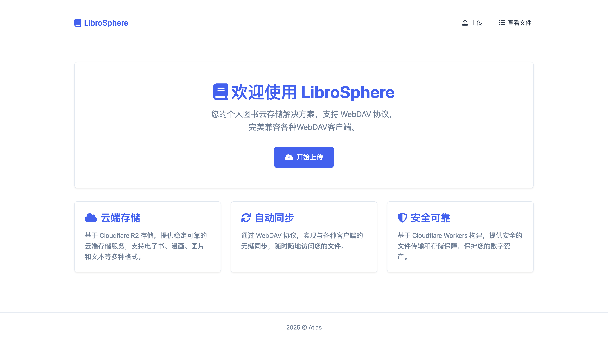
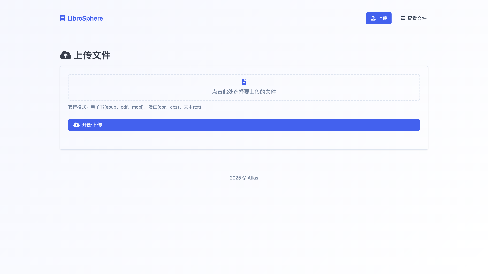
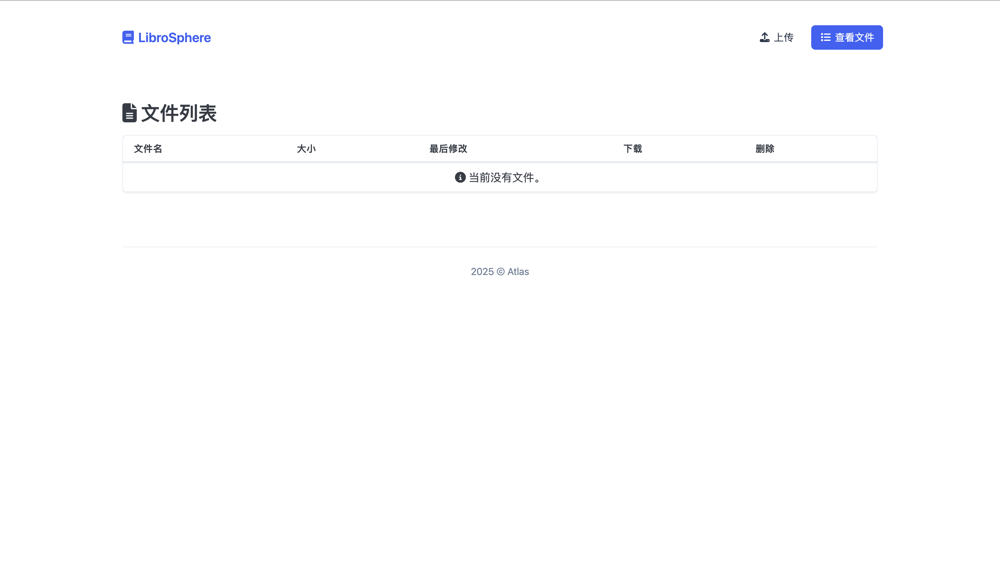
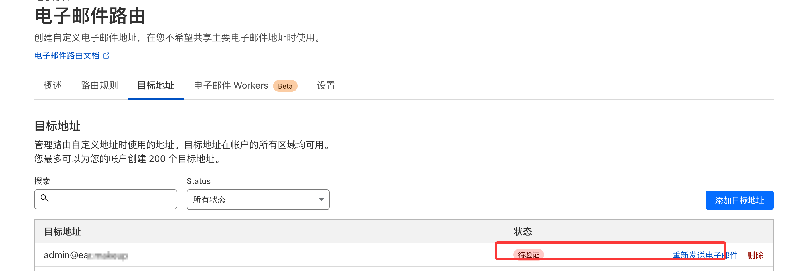
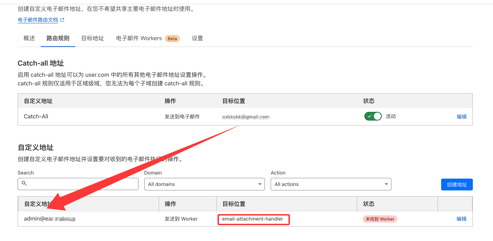
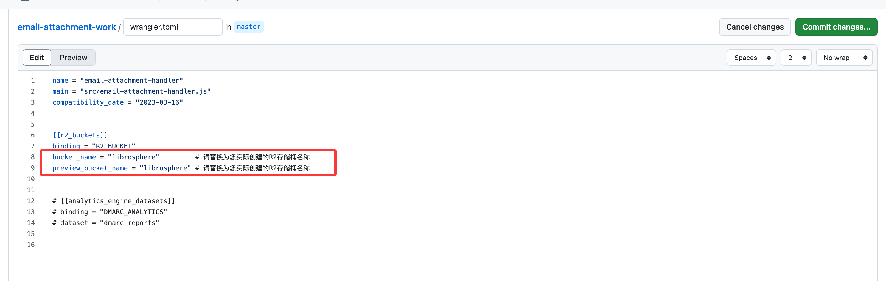
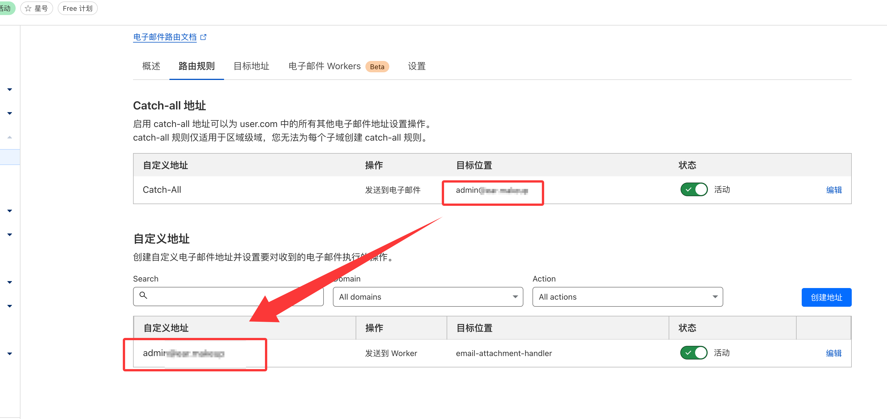

# LibroSphere - 智能电子书云存储系统

## 项目概述

LibroSphere是一个基于Cloudflare Workers和R2存储构建的现代化电子书管理系统，提供WebDAV服务接口，完美兼容WebDAV协议。它让您可以随时随地访问和管理您珍贵的电子书收藏。

## 项目截图

### 首页

### 上传页面

### 文件列表

## 核心功能

- **云端存储** - 基于Cloudflare R2
- **跨平台支持** - 完全兼容WebDAV客户端
- **安全可靠** - 基本身份验证保护，确保数据安全
- **零维护** - 无服务器架构，免去服务器维护烦恼
- **简洁界面** - 提供直观的上传、浏览和管理界面

## 快速部署

### 前提准备

- Cloudflare账户
- GitHub账户

### 部署步骤

1. **创建R2存储桶**
   - 登录Cloudflare控制面板
   - 创建名为`librosphere`的R2存储桶

2. **获取API凭证**
   - 创建Cloudflare API令牌，确保有R2和Workers权限
   - 记录您的Cloudflare账户ID

3. **配置仓库**
   - 复刻LibroSphere仓库
   - 添加`CF_API_TOKEN`和`CF_ACCOUNT_ID`密钥

4. **启动部署**
   - 运行GitHub Actions部署工作流
   - 设置Workers应用的用户名(USERNAME)和密码(PASSWORD)

5. **访问您的LibroSphere**
   - 使用`https://LibroSphere-worker.username.workers.dev/web`

LibroSphere - 让您的电子书触手可及，随时随地享受阅读。

## 配合Z-Library邮件附件自动存储

> 通过配合[email-attachment-work](https://github.com/omskk/email-attachment-work)项目，您可以快速获取Z-Library电子书并自动存储到R2中。

### 配置步骤

1. **准备工作**
   - 注册Cloudflare账户并绑定您的域名
   - 确保您的R2存储桶已正确创建

2. **配置电子邮件路由**
   - 进入域名管理 → 电子邮件 → 电子邮件路由 → 启用电子邮件
   - 添加目标地址：绑定您自己的邮箱以接收邮件
   

3. **设置邮件转发规则**
   - 进入"路由规则" → "自定义地址"
   - 新增一个地址：`admin@您的域名`
   - 操作选择"发送到电子邮件"，目标位置选择您刚才绑定的邮箱
   - 在目标地址设置中将`admin@您的域名`绑定到您的邮箱
   

4. **部署附件处理应用**
   - Fork [email-attachment-work](https://github.com/omskk/email-attachment-work) 项目
   - 修改配置中的存储桶名称为您的R2存储桶
   
   - 将项目部署到Cloudflare Workers

5. **完成邮件路由配置**
   - 将`admin@您的域名`绑定到Worker，目标位置选择`email-attachment-handler`
   - 开启"Catch-all地址"设置，将所有未指定的邮件转发到`admin@您的域名`
   - 最终路由配置效果如下：
   

### 工作原理

完成配置后，所有发送到您域名的邮件都会被转发到`admin@您的域名`，然后由附件处理Worker自动提取邮件中的附件并存储到R2存储桶中。

> **提示**：如果需要注册其他服务并接收验证码，请先创建自定义邮件地址直接转发到您的个人邮箱，因为自定义地址不会经过Catch-all规则处理。

